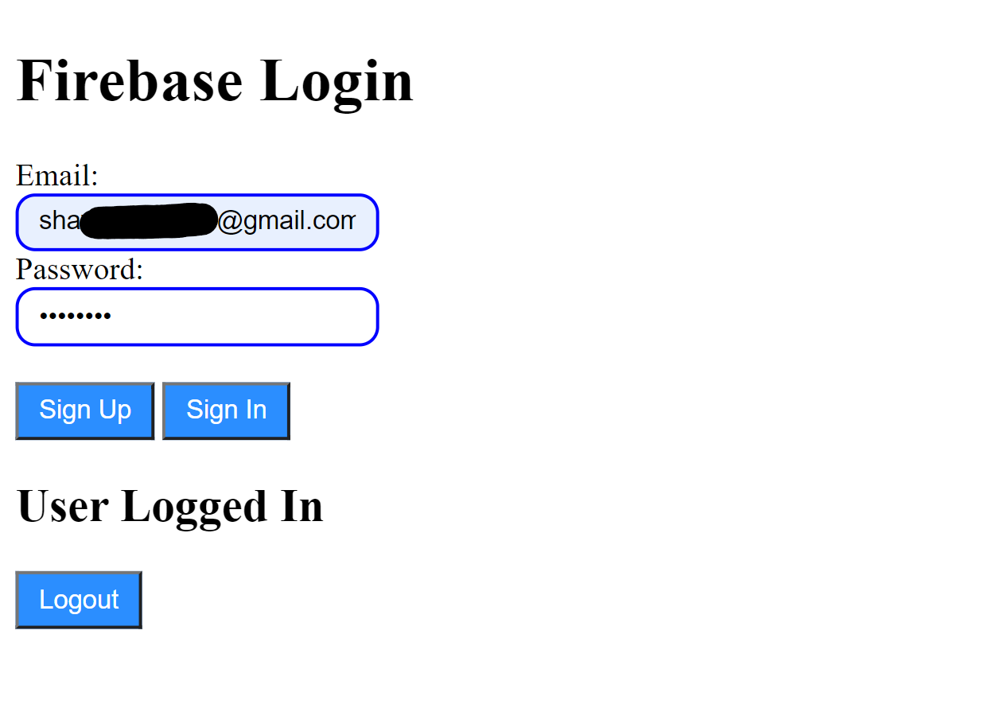

# Firebase Login Demo

A simple signin/signout system

## ** How to run
To test firebase functions you need to load the html file on [localhost](https://whatismyipaddress.com/localhost).

An easy way to do this is by using the Live Server extension for VS Code to open the html file in your browser at http://localhost:5500/index.html

---

### Screenshots

Create your own projects using the Firebase Console: https://console.firebase.google.com
